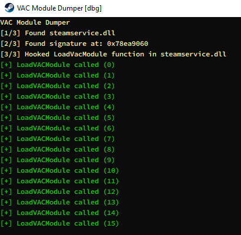
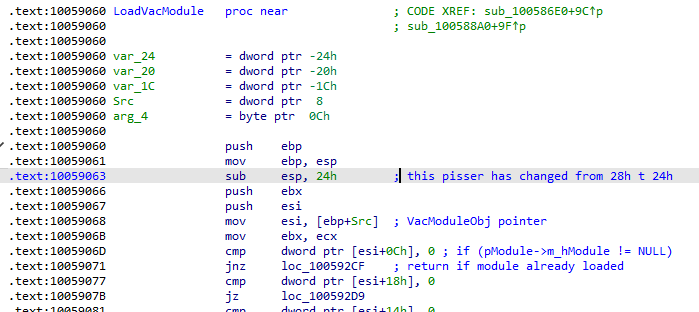

# VAC Module Dumper


*Console output demo.*


*Screenshot of the patched assembly (offset changed from `28h` to `24h`).*

---

## 🚀 Introduction
The **VAC Module Dumper** hooks the `LoadVACModule` function in `steamservice.dll`, captures in-memory modules, and dumps them as DLL files.

- **Hooking** via [MinHook](https://github.com/TsudaKageyu/minhook)

## 🛠️ Requirements

- Windows 7 or later
- Visual Studio 2019/2022 (or compatible compiler)
- [MinHook](https://github.com/TsudaKageyu/minhook) library

## 🚀 Usage

1. **Inject** the built DLL into the target process (steam.exe started as admin):
   ```bash
   injector.exe -p steam.exe -d Release\vacmoduledumper.dll
   ```
2. **Start** a vac protected game
3. **Find** dumped modules in `C:\vac_modules` (configurable via `dumpPath`).

## 📄 License

This project is licensed under the [MIT License](LICENSE).

---

*Happy dumping!*
